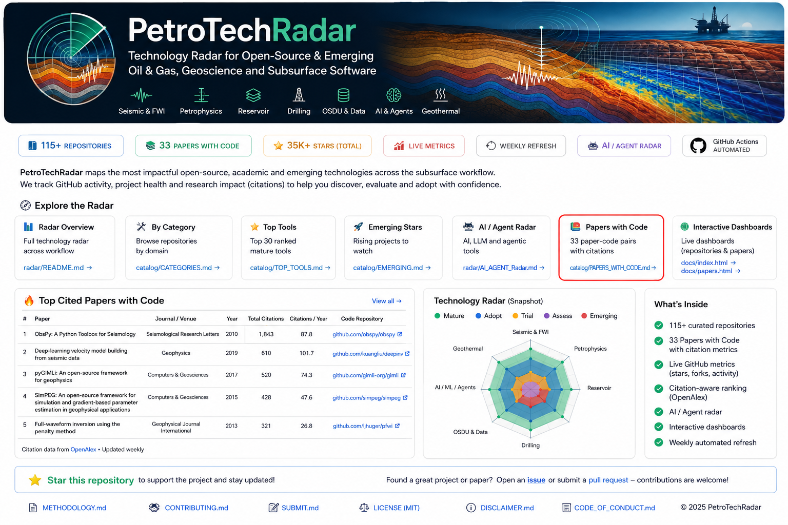

<p align="center"></p>

<div align="center">

# ⛽ PetroTechRadar

### Open-source & emerging technology radar for oil & gas, geoscience and subsurface engineering

**115 curated repositories · 33 Papers with Code · live GitHub metrics · citation-aware research ranking · AI/Agent radar · FWI/Seismic · Petrophysics · Reservoir · Drilling · OSDU · Geothermal**

[](https://santoshdhubia.github.io/PetroTechRadar/)
[](catalog/PETROTECHRADAR_V1.csv)
[](.github/workflows/refresh-radar.yml)

</div>

---

## What is PetroTechRadar?

**PetroTechRadar** tracks software being built across the oil & gas and subsurface technology ecosystem — from mature open-source foundations to new AI agents, MCP servers, research code, rapid prototypes and vibe-coded engineering tools.

> **Find what is useful, what is emerging, and what is worth watching.**

Unlike a traditional “awesome list”, PetroTechRadar combines **technical curation** with **live GitHub metrics** so established tools and newer high-potential projects can be compared more fairly.

---

## Radar Snapshot

| Metric | Current V1 |
|---|---:|
| **Repositories tracked** | **115** |
| **Core tools** | **32** |
| **Emerging / AI / vibe-coded** | **43** |
| **Research repositories** | **28** |
| **Reference resources** | **12** |
| **Papers with Code** | **33** |
| **Data refresh** | **Weekly** |

---

## Explore the Radar

| Radar | What you will find |
|---|---|
| 🤖 **[AI Agents, MCP & Engineering Copilots](catalog/AI_AGENT_RADAR.md)** | Petroleum agents, reservoir copilots, drilling RAG, OSDU agents and MCP servers |
| 🌊 **[Seismic & Geophysics](catalog/SEISMIC_RADAR.md)** | FWI, RTM, inversion, SEG-Y, wave propagation, seismic ML and visualization |
| 🧪 **[Research Radar](catalog/RESEARCH_RADAR.md)** | Research code, datasets, technical methods and benchmarks |
| 🚀 **[Emerging & Vibe-Coded](catalog/EMERGING_RADAR.md)** | New apps, experimental tools, rapid prototypes and early-stage projects |
| 🏆 **[Top Ranked Repositories](catalog/TOP_REPOSITORIES.md)** | Highest PetroTechRadar scores based on technical relevance + activity |
| 📚 **[Papers with Code](catalog/PAPERS_WITH_CODE.md)** | Peer-reviewed paper–code pairs with citation and reproducibility metrics |
| 📊 **[Full Repository Matrix](catalog/PETROTECHRADAR_V1.csv)** | Complete curated V1 repository dataset and metrics |
| 🗂️ **[Other Repositories](catalog/OTHER_REPOSITORIES.csv)** | Additional projects retained for reference or future re-evaluation |

---

## Technology Areas

| Area | Coverage |
|---|---|
| 🌊 **Seismic & Imaging** | FWI, RTM, inversion, velocity modelling, SEG-Y, seismic ML |
| 🧾 **Petrophysics** | LAS, well logs, saturation, permeability, rock physics |
| 🛢 **Reservoir** | Simulation, PVT, DCA, material balance, EOR, surrogate models |
| 🛠 **Drilling & Wells** | MWD/LWD, ROP, pore pressure, drilling reports, wellbore analytics |
| 🤖 **AI / Agents** | LLMs, MCP, RAG, multi-agent systems, engineering copilots |
| 🗄 **Data & OSDU** | OSDU, interoperability, conversion, standards, semantic layers |
| 🌋 **Geothermal** | Prospectivity, seismicity, exploration and geothermal AI |
| 🗺 **Geoscience** | Interpretation, geostatistics, geological ML and visualization |
| ⚙ **Production** | Optimization and operational analytics |

---

## Featured Emerging Projects

| Project | Area | Why it is interesting |
|---|---|---|
| **[opm-ai](https://github.com/pranay-gpt/opm-ai)** | AI + Reservoir Simulation | Natural-language reservoir simulation around OPM Flow |
| **[pyrestoolbox-mcp](https://github.com/gabrielserrao/pyrestoolbox-mcp)** | MCP + Reservoir Engineering | Deterministic reservoir calculations exposed to AI assistants |
| **[petro-agent](https://github.com/OilCoder/petro-agent)** | AI + Petrophysics | Agentic LAS-to-petrophysics workflow with deterministic calculations |
| **[SiameseFit-pub](https://github.com/DeepWave-KAUST/SiameseFit-pub)** | FWI + ML | Learned seismic comparison for cycle-skipping mitigation |
| **[og-agentic-patterns](https://github.com/rkkalluri-dbx/og-agentic-patterns)** | Oil & Gas Agents | Agentic workflows for SCADA, alarms, wells and HSE |
| **[drilling-report-qa](https://github.com/mosalama74/drilling-report-qa)** | RAG + Drilling | Local document intelligence for Daily Drilling Reports |
| **[Seismo-Lingo](https://github.com/yberkayozkan/Seismo-Lingo-Smart-Geophysical-Assistant)** | AI + Geophysics | Natural-language interaction with SEG-Y and LAS |

---

## Live Repository Matrix

Every tracked repository can include:

**⭐ Stars · 🍴 Forks · 🧩 Issues · 👀 Watchers · 💻 Language · 📜 License · 📅 Created · 🔄 Last push · 📈 Stars/month · ⚡ Activity Score · 🎯 PetroTechRadar Score**

### **[→ Open the full PetroTechRadar matrix](catalog/PETROTECHRADAR_V1.csv)**

GitHub metadata and generated rankings are refreshed periodically so the radar remains current.

---

## How Ranking Works

GitHub popularity is useful, but **stars do not define technical value**.

```text
PetroTechRadar Score
├── 70% Curated technical tier
└── 30% GitHub activity
       ├── Stars
       ├── Forks
       ├── Last activity
       └── Issue activity
```

The GitHub component is logarithmically scaled so very large repositories do not overwhelm smaller but technically important projects.

---

## 🌐 Live Dashboard

Search, filter and sort the radar by:

**Domain · Tier · Stars · Stars/month · Latest activity · PetroTechRadar Score**

### **[Open PetroTechRadar Live Dashboard](https://santoshdhubia.github.io/PetroTechRadar/)**

---

## Radar Tiers

| Tier | Meaning |
|---|---|
| 🟢 **Core** | Established and practically useful software |
| 🔵 **Emerging** | AI, agents, MCP, new apps and rapid-development projects |
| 🟣 **Research** | Reproducible methods, datasets and research implementations |
| ⚪ **Reference** | Standards, tutorials, datasets and supporting tools |

---

## 📚 Papers with Code

PetroTechRadar also tracks **peer-reviewed geophysics and computational-geophysics papers with public code**.

The paper matrix combines scientific impact with repository health:

**Journal · Year · Topic · GitHub repository · Stars · Reproducibility · Total citations · Citations/year · Papers-with-Code Score**

Citation impact is balanced with **citations/year** so recent papers are not unfairly penalized.

- **[Papers with Code matrix](catalog/PAPERS_WITH_CODE.md)**
- **[Scoring methodology](catalog/PAPERS_WITH_CODE_METHOD.md)**
- **[Interactive Papers dashboard](https://santoshdhubia.github.io/PetroTechRadar/papers.html)**

Citation metrics are sourced from **OpenAlex** and repository-health metrics from GitHub.

<!-- TOP-CITED-PAPERS:START -->

### 🔥 Top Cited Papers with Code

| Paper | Journal | Year | Citations | Cit./yr | Code |
|---|---|---:|---:|---:|---|
| [ObsPy: A Python Toolbox for Seismology](https://doi.org/10.1785/gssrl.81.3.530) | Seismological Research Letters | 2010 | **1,843** | 108.4 | [GitHub](https://github.com/obspy/obspy) |
| Deep-learning inversion: A next-generation seismic velocity model building method | GEOPHYSICS | 2019 | **611** | 76.4 | [GitHub](https://github.com/YangFangShu/FCNVMB-Deep-learning-based-seismic-velocity-model-building) |
| [pyGIMLi: An open-source library for modelling and inversion in geophysics](https://doi.org/10.1016/j.cageo.2017.07.011) | Computers & Geosciences | 2017 | **520** | 52.0 | [GitHub](https://github.com/gimli-org/pyGIMLi) |
| [SimPEG: An open source framework for simulation and gradient based parameter estimation in geophysical applications](https://doi.org/10.1016/j.cageo.2015.09.015) | Computers & Geosciences | 2015 | **428** | 35.7 | [GitHub](https://github.com/simpeg/simpeg) |
| Mitigating local minima in full-waveform inversion by expanding the search space | Geophysical Journal International | 2013 | **321** | 22.9 | [GitHub](https://github.com/slimgroup/PenaltyMethodGJI) |

**[→ View all Papers with Code](catalog/PAPERS_WITH_CODE.md)** · **[Rank by citations](catalog/TOP_CITED_PAPERS.md)**

_Citations: OpenAlex · automatically refreshed._

<!-- TOP-CITED-PAPERS:END -->

---

## What belongs here?

Projects are considered when they offer meaningful relevance to:

**Exploration · Geophysics · Geology · Petrophysics · Reservoir Engineering · Drilling · Production · Subsurface Data · AI for Energy · Geothermal**

Priority is given to repositories with meaningful technical implementation, petroleum/subsurface-specific logic, reproducible research, active development, emerging AI/agent workflows, useful domain formats, or new approaches to engineering automation.

Projects that are relevant but not selected for the current curated V1 remain available in **[Other Repositories](catalog/OTHER_REPOSITORIES.csv)** for future re-evaluation.

---

## Disclaimer

PetroTechRadar is an independent curated technology index. Inclusion or ranking of a repository, paper, organization or project does **not constitute endorsement, certification or commercial recommendation**.

GitHub metrics, citation counts and automated metadata may change over time and should be independently verified before technical, academic or commercial use.

**[Read the full disclaimer](DISCLAIMER.md)**

---

## Project Governance

[Methodology](METHODOLOGY.md) · [Contributing](CONTRIBUTING.md) · [Submit](SUBMIT.md) · [Disclaimer](DISCLAIMER.md) · [Code of Conduct](CODE_OF_CONDUCT.md) · [MIT License](LICENSE)

<div align="center">

### PetroTechRadar

**Discover what is being built for the subsurface.**

[Live Dashboard](https://santoshdhubia.github.io/PetroTechRadar/) ·
[Full Matrix](catalog/PETROTECHRADAR_V1.csv) ·
[Papers with Code](catalog/PAPERS_WITH_CODE.md) ·
[Emerging Radar](catalog/EMERGING_RADAR.md)

</div>
